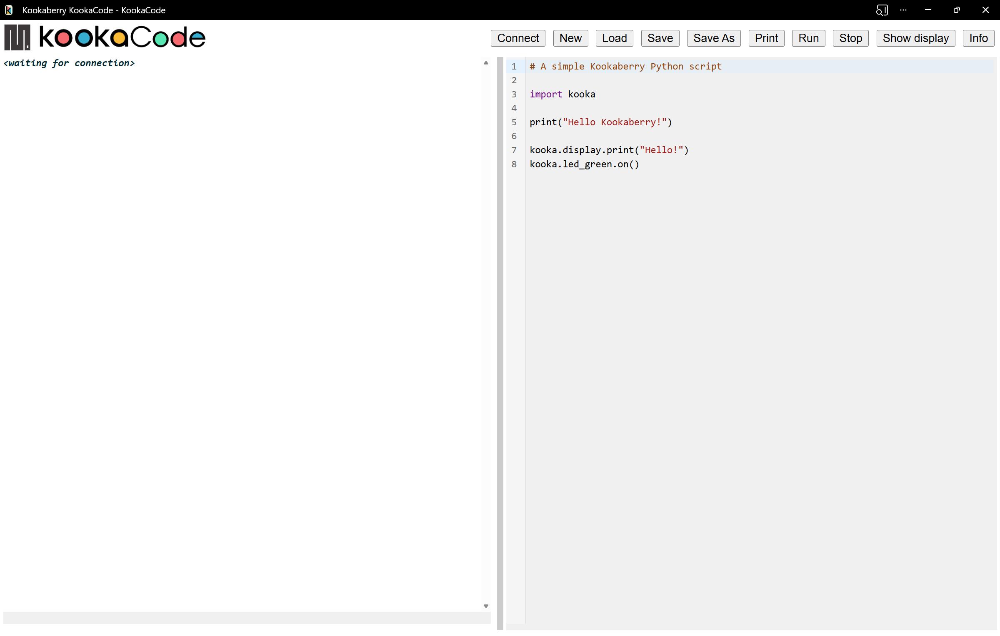
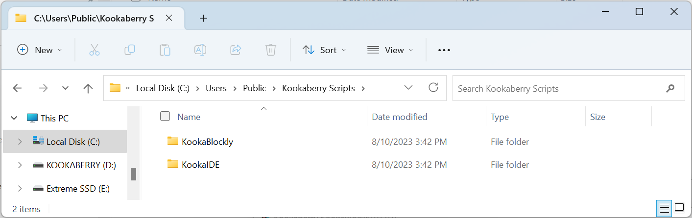

Access and Install KookaCode
============================

**KookaCode** is part of a set of code development and editing tools for the Kookaberry microcomputer 
and other microcomputer boards that can use the Kooka firmware.

The tools are:

KookaBlocs
  a powerful standalone visual editor designed for creating program scripts.

KookaCode
  a text editor for creating and editing MicroPython program scripts and directly interacting with the Kookaberry control console.

These scripting tools replace the previous **KookaSuite** toolset, comprising **KookaBlockly**, **KookaIDE** and **KookaTW**, 
which were installed as apps directly on personal computers (Windows, Macintosh, and Raspberry Pi).

This new iteration of tools are:

* much simpler to access, 
* support an enlarged set of computer types, particularly the Chromebook,
* can be installed as Progressive Web Applications (PWA) for off-line use,
* are much simpler to keep up to date,
* are less vulnerable to malware.

Accessing KookaCode
--------------------

Using a Chrome (or related) web browser on a personal computer, go to the following address https://auststem.com.au/KookaCode.

The web browser should show the KookaCode interface as shown below:

.. _kcode_canvas:

KookaCode is a Progressive Web Application (PWA). A PWA is a website that works and feels like a native mobile or desktop app, 
without needing to be downloaded from an app store.

Instead of opening KookaCode in a browser tab every time, you can install it once from the website. 
It then appears on your home screen, taskbar, or app menu—just like a regular app.

PWAs will work offline. They can cache content so they continue to work even if your internet connection drops or is slow. When you go back online, 
they synchronise any changes.

The developer can update a PWA instantly on their server, and everyone gets the latest version automatically. 
By refreshing the browser while online, the latest updates will be automatically downloaded.

Compatible Web browsers
-----------------------

These are the compatible web browsers and the PCs on which they run:

* Google Chrome (Windows / macOS / Linux / ChromeOS)
* Microsoft Edge (Windows / macOS / Linux)
* Vivaldi (Windows / macOS / Linux)

KookaCode will not run successfully on tablets or smart phones as the necessary functionality for connecting to the Kookaberry 
is not supported on these devices.

Installing KookaCode
---------------------

On all compatible browsers, PWAs are installed from the address bar (or app menu) when the site is PWA‑capable, 
and uninstalled from the browser’s app list or OS app management. The exact labels and locations differ slightly per browser.

Below is a concise summary per browser.

Google Chrome
~~~~~~~~~~~~~

Online help: https://support.google.com/chrome/answer/9658361?hl=en&co=genie.platform%3DDesktop# 

To install as a PWA, navigate to the KookaCode website. Look at the right side of the address bar:

* If installable, you will see an “Install app” icon (a computer with a down arrow), or a prompt “Install [app name]”.
* Click the Install button.
* Confirm in the dialog.

Chrome will then:

* Add an app entry to the OS (Start menu on Windows, Applications folder/Launchpad on macOS, app launcher on Linux/ChromeOS).
* Optionally create a desktop/taskbar shortcut depending on your OS and settings.

KookaCode now opens in a standalone window without the usual browser UI (tabs, address bar).

To uninstall KookaCode, any of these methods work:

* Open the PWA window, open the ⋮ menu and choose Uninstall [app name] (or “App info” → “Uninstall”). or
* In Chrome, go to chrome://apps (or Settings → Apps → Manage apps in recent builds). or
* On the desktop or task-bar, right‑click the KookaCode icon and select Remove from Chrome / Uninstall. or
* From the OS, use the normal OS app management (e.g. Windows “Apps & features”, macOS drag app icon to Trash) and remove the PWA entry if visible.

Chrome will clean up the browser app entry and optionally ask whether to delete associated data.

Microsoft Edge
~~~~~~~~~~~~~~

Online help: https://learn.microsoft.com/en-us/microsoft-edge/progressive-web-apps/ux 

To install as a PWA, navigate to the KookaCode website. 

* In the Edge toolbar, look for the “App available – Install” icon on the right of the address bar, or:
* Open the ⋯ (Settings and more) menu.
* Choose Apps → Install this site as an app.
* In the dialog, confirm the name. Optionally choose whether to pin to taskbar/start menu, auto‑start, etc.
* Click Install.

Edge creates a standalone app window and registers it with the OS.

To uninstall KookaCode, use any of the following methods:

* From the KookaCode window, open ⋯ in the title bar (or Edge menu) and choose Uninstall [app name]. or 
* From within Edge, go to Settings → Apps → Manage apps. Find the app in the list, click the ⋯ menu next to it, choose Uninstall.
* From the OS, remove it via the regular app list (e.g. Windows Start → right‑click → Uninstall).

Edge also lets you clear data when uninstalling.

Vivaldi
~~~~~~~

Online help: https://help.vivaldi.com/desktop/miscellaneous/progressive-web-apps/ 

Vivaldi supports installed web apps / standalone windows via Chromium’s app mechanism.

To install KookaCode as a PWA, navigate to the KookaCode website in Vivaldi, and use one of these approaches (depending on version):

* Common current pattern: Click the “+” / Install icon in the address bar when offered, then choose Install [app name].
* Or manually: Open Vivaldi menu. Go to Tools → Create Shortcut… (or Tools → Install Web App… on some builds).
* In the dialog, tick “Open as window” (or “Treat as app / Open in separate window”).
* Confirm Create / Install.

The site is now registered as a web app and opens in a separate window without full browser chrome. 
An OS shortcut may be created depending on options you selected.

To uninstall KookaCode, use one of the following methods:

* From the KookaCode window, use the Vivaldi menu for that window and look for Uninstall [app name], Remove App, or Remove shortcut (label varies across versions); confirm removal.
* From Vivaldi’s app/shortcut management, open Vivaldi menu → Tools → Show Installed Apps / Show Shortcuts (name can differ) and delete the entry.
* From the OS, remove the shortcut / app entry created for that web app (e.g. from Start menu or Applications folder).

Removing the app de‑registers the standalone window behavior; visiting the URL in a normal tab still works as usual.

Script Folders
--------------

KookaCode does not prescribe any particular folder location.  
It is however recommended that the folder structure that was the convention in the **KookaSuite** set of desktop apps be retained and followed.
See :numref:`wininstallfolders`.

That is, either in the the user's ``Home\`` or ``Documents\`` folder or in the ``Public\`` folder:

* at the top level, the ``Kookaberry Scripts\`` folder 
* within that folder, a folder called ``KookaBlockly\`` or ``KookaCode\``

.. _wininstallfolders:

   The Kookaberry Scripts folder in a fresh **KookaSuite** installation.

KookaCode Updates
------------------

Occasionally when **KookaCode** updates are released, the forms and functions of some blocks may be changed.

Existing **KookaCode** scripts will retain the forms and functions of blocks as last edited.  
Updates to the blocks are not automatically applied to pre-existing scripts.

If the newer block is desired, then the **KookaCode** script must be edited and the block explicitly replaced by the newer form from the block palette.

Once an older block is removed it can no longer be used as it will no longer be available from the palette of blocks.

Editing KookaBlocs Scripts Using KookaIDE or KookaCode
--------------------------------------------------------

A **KookaBlocs** file, designated with the file type suffix ``.kby.py``, 
contains the MicroPython script that is automatically generated by the **KookaBlocs** editor 
as visual blocks are assembled and configured.
At the end of the **KookaBlocs** file there is a very long comment line which contains the code, in XML (Extended Markup Language) format, 
that describes all the blocks, their parameters and their inter-connections.

While it is possible to edit a **KookaBlocs** file using the **KookaIDE** or **KookaCode** editor and to then run it on the Kookaberry, 
any changes made will not alter the XML block code.
As soon as the **KookaBlocs** file is again opened by the **KookaBlocs** editor, it will regenerate the MicroPython script 
based on the XML block code, and it will disregard any changes made to the MicroPython script.

Attempting to edit the XML code directly will likely render the **KookaBlocs** file unusable by the **KookaBlocs** editor, 
so please do not edit the XML code.

.. Important:: 
   Only edit **KookaBlocs** files using the **KookaBlocs** editor!