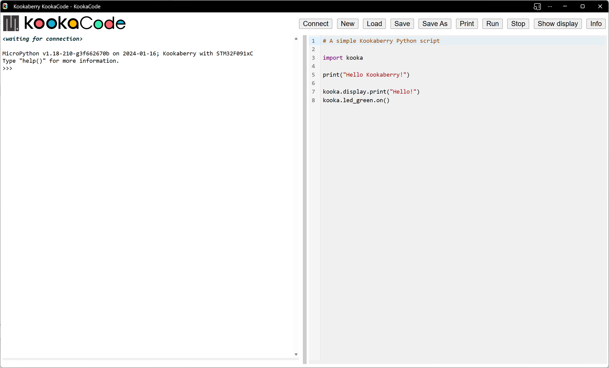

Introduction to KookaCode
============================

KookaCode: MicroPython Programming Editor for Kookaberry Microprocessor Boards
------------------------------------------------------------------------------

**KookaCode** is a powerful editor designed for creating program scripts for **Kookaberry** and related microprocessor boards. 

.. _simplescript:

   This is the **KookaCode** display with an example **MicroPython** script. 

The example shown above is a simple script that shows ``Hello Kookaberry`` on the **Kookaberry** display, prints ``Hello`` on the console, 
and lights the **Kookaberry**'s green **LED**.  

**KookaCode** was created by Damien George (George Robotics – MicroPython) in collaboration with Kookaberry Pty Ltd. 
It also received support from the AustSTEM Foundation, the Warren Centre, and the Vonwiller Foundation.

Key Features
------------

Comprehensive User Interface: 
    **KookaCode** is an **Integrated Development Environment** (IDE).
    Users can create **MicroPython** scripts and run them on a **Kookaberry** without needing to compile, upload and flash binary files.
    The script editor includes Python auto-complete functionality, aiding the creation of syntactically correct **MicroPython** scripts.
    Includes the **Kookaberry**'s console interface so users can directly inspect, monitor, debug and control the **Kookaberry**.
    The **Kookaberry** display can be viewed on the PC's display facilitating sharing for educational and documentation purposes.

Compatibility: 
   The generated code can be utilized on most microprocessor boards that use **MicroPython**, 
   but is particularly suited to those with **Kookaberry** firmware for **STM**, **RP2040** and **RP2350** microprocessors.

Platform Compatibility: 
   **KookaCode** runs as a Progressive Web Application (PWA) within the Google Chrome we browser and browsers that are based on Chrome. 
   Any personal computer that supports the Chrome web browser can be used.  This includes PCs running **Microsoft Windows** 10 or 11, 
   **Apple MacOS**, **Linux**, **Chrome OS** (Chromebook), and **Raspberry Pi Raspbian** operating systems.

Easy Access: 
   The latest version of **KookaCode** can be conveniently downloaded from the AustSTEM website  
   at https://auststem.com.au/KookaCode.

   Follow the :doc:`installing` guide in the next section to initiate and, for offline use, to install **KookaCode**.

Programming the Kookaberry With KookaCode
-----------------------------------------

Using **KookaCode** is straight forward and enjoyable. 

Users can load, cut and paste, and directly edit **MicroPython**  code in the **Workspace**. 
Code elements are coloured to emphasise **MicroPython** syntax elements.

`The Kookaberry Reference Guide<https://kookaberry-reference-guide.readthedocs.io/en/latest/>`_ provides a comprehensive guide 
to using the **Kookaberry** and programming it using **MicroPython**.

With **KookaCode**, programming becomes an enjoyable, productive and accessible endeavour.

AustSTEM Learning Hub
---------------------

AustSTEM has assembled a collection of resources on its Learning Hub at https://learn.auststem.com.au.  
These resources complement the material in this manual with examples, lesson plans, descriptions of equipment and of their application.