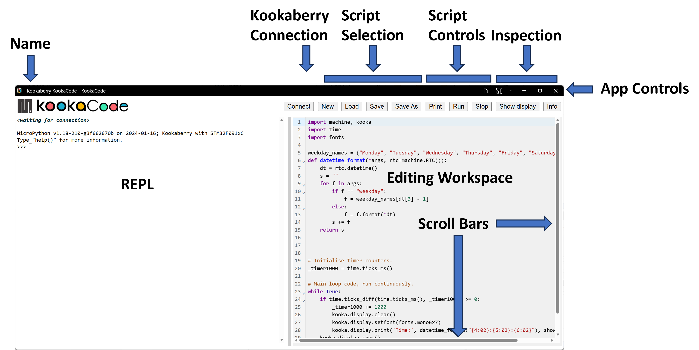
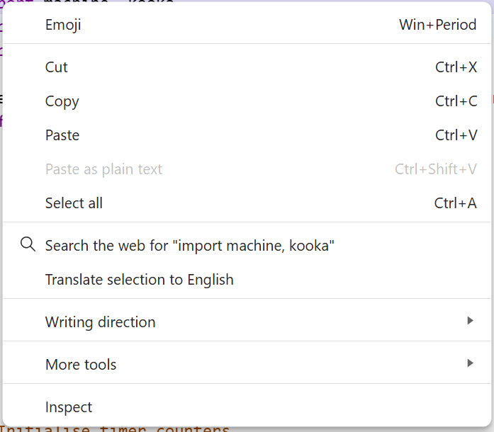
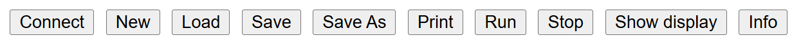
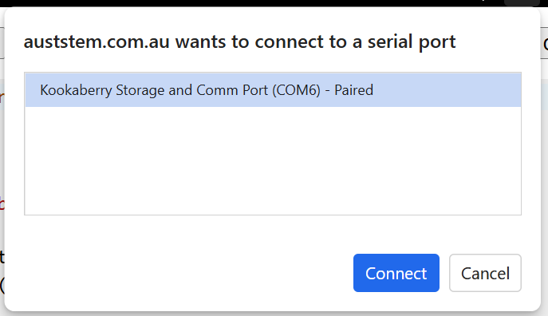
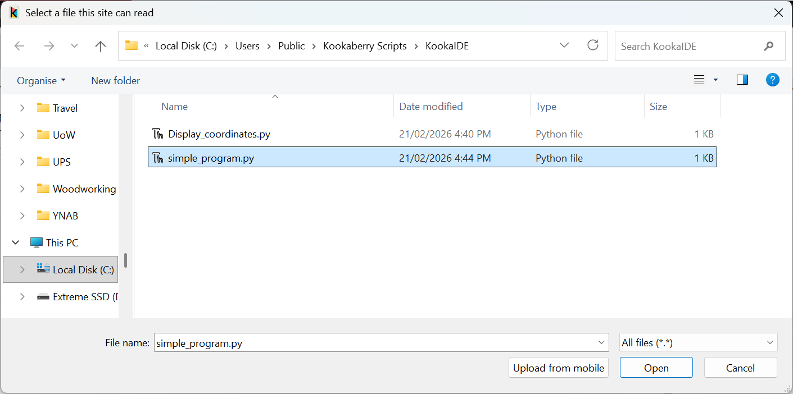
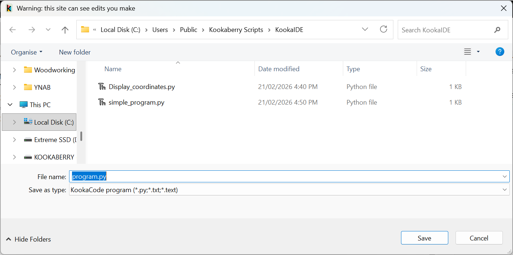
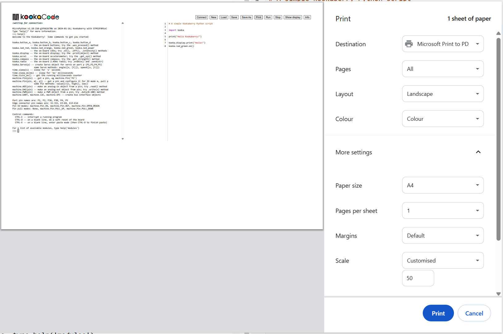
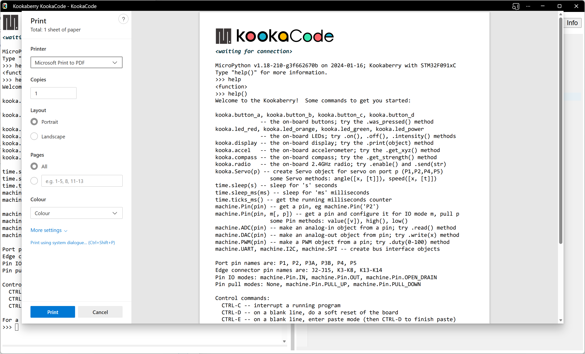
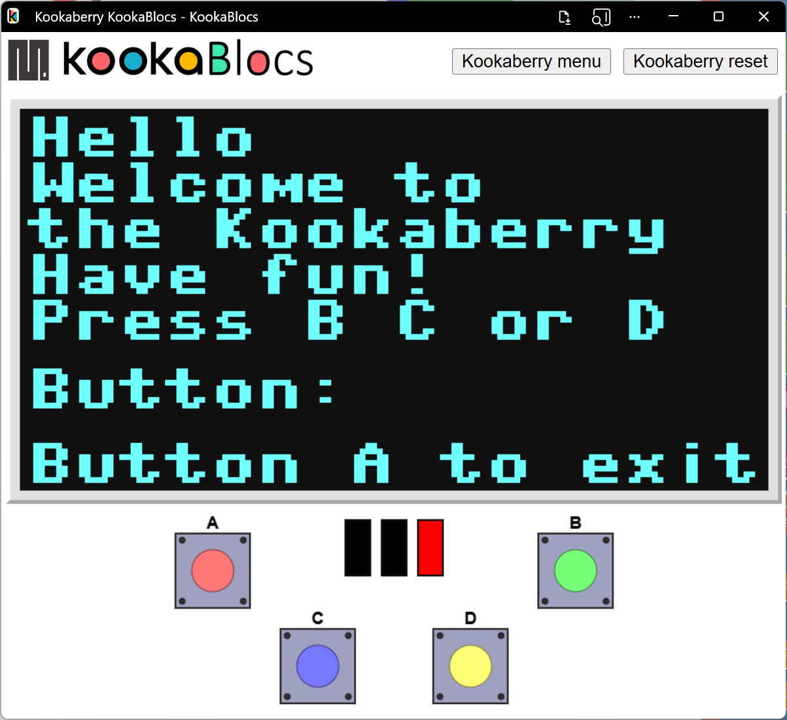

Using the KookaCode Application
===============================

This guide explains how to use the **KookaCode** application to create and un **MicroPython** scripts for the **Kookaberry**.

To learn about MicroPython scripting for the **Kookaberry**, please refer to the `Kookaberry Reference Guide`_.

.. _Kookaberry Reference Guide: https://kookaberry-reference-guide.readthedocs.io/en/latest/

Launching KookaCode using a compatible browser on a personal computer will result in the display shown:

.. _kblocsdisplay:

   This is the **KookaCode** display with the controls labelled.
   
The application window has numerous controls, as are described below:

Name
----

The PWA name **KookaCode** is shown at the top-left of the **KookaCode** window.

.. note::
  
   The latest version of **KookaCode** can be conveniently updated from the website by refreshing the browser window using the key combination ctrl-R.
 
   See the section :doc:`installing` for instructions on installing / uninstalling **KookaCode** on the various supported we browsers.

App Controls
------------

These controls allow the **KookaCode** window to be minimises or maximised, and the **KookBlocs** application to be exited.  

Depending on the web browser being used, there may be other controls for browser settings and functions. 
:numref:`pwactrls` shows the appearance of these controls for the Microsoft Edge browser.

.. _pwactrls:

   The KookaCode PWA Controls

.. important::
  If the **KookCode** script has not been saved before attempting to exit **KookaCode** will exit anyway - 
  it does not keep track of whether there are unsaved edits.  Please be careful to regularly save your work!

Resizing of the window can also be accomplished by clicking on the window edges and dragging to resize.

Editing Workspace
-----------------

On the right is the **KookaCode** **Editing Workspace** for **MicroPython** script.  

Scripts can be typed, loaded from file, copied, cut and pasted in this space, by using a keyboard and mouse or track-pad or pointing device.  

**KookaCode** embeds the `CodeMirror`_ open‑source text editor to provide an in‑browser coding experience tailored for Python. 
The editor offers Python-aware syntax highlighting, so language constructs such as keywords, strings, numbers, comments, 
and built‑ins are visually distinguished to improve readability and reduce syntax errors. 
It also supports automatic indentation and standard code-editing features such as line numbers, bracket matching, 
and configurable themes for a familiar development environment.

.. _CodeMirror: https://codemirror.net

Python auto-completion is enabled to suggest variable names, functions, and other identifiers as you type, 
helping you write code faster and with fewer typos. 
Completion suggestions appear in a popup list that you can navigate with the keyboard, and a dedicated shortcut (commonly Ctrl+Space) 
lets you trigger suggestions on demand. 
Together, these features make the editor suitable for tasks ranging from quick code snippets to more substantial 
Python script development directly in the browser.

The script editor has numerous keyboard shortcuts for editing commands:

+-------------------------------+------------------+---------------------------------------------+
| Action                        | Windows / Linux  | macOS                                       |
+===============================+==================+=============================================+
| Select all                    | Ctrl + A         | Command + A                                 |
+-------------------------------+------------------+---------------------------------------------+
| Undo                          | Ctrl + Z         | Command + Z                                 |
+-------------------------------+------------------+---------------------------------------------+
| Redo                          | Ctrl + Y         | Command + Y                                 |
+-------------------------------+------------------+---------------------------------------------+
| Delete current line           | Ctrl + D         | Command + D                                 |
+-------------------------------+------------------+---------------------------------------------+
| Move to start of document     | Ctrl + Home      | Command + Home                              |
+-------------------------------+------------------+---------------------------------------------+
| Move to end of document       | Ctrl + End       | Command + End                               |
+-------------------------------+------------------+---------------------------------------------+
| Move to start of line         | Home             | Home                                        |
+-------------------------------+------------------+---------------------------------------------+
| Move to end of line           | End              | End                                         |
+-------------------------------+------------------+---------------------------------------------+
| Indent line/selection         | Ctrl + ]         | Command + ]                                 |
+-------------------------------+------------------+---------------------------------------------+
| Dedent line/selection         | Ctrl + [         | Command + [                                 |
+-------------------------------+------------------+---------------------------------------------+
| Auto-indent line/selection    | Shift + Tab      | Shift + Tab                                 |
+-------------------------------+------------------+---------------------------------------------+
| Insert tab / indent selection | Tab              | Tab                                         |
+-------------------------------+------------------+---------------------------------------------+
| New line with auto‑indent     | Enter            | Enter                                       |
+-------------------------------+------------------+---------------------------------------------+
| Find                          | Ctrl + F         | Command + F                                 |
+-------------------------------+------------------+---------------------------------------------+
| Find next                     | Ctrl + G         | Command + G                                 |
+-------------------------------+------------------+---------------------------------------------+
| Find previous                 | Shift + Ctrl + G | Shift + Command + G                         |
+-------------------------------+------------------+---------------------------------------------+
| Replace                       | Shift + Ctrl + F | Shift + Command + F or Command + Option + F |
+-------------------------------+------------------+---------------------------------------------+
| Save (if bound by host app)   | Ctrl + S         | Command + S                                 |
+-------------------------------+------------------+---------------------------------------------+

Selecting text and right-clicking open a context-sensitive menu of available actions.

.. _rightclickmenu:

   The right-click context-sensitive menu

.. note::
   The context-sensitive menu is generated by the web browser used for the PWA and most of the available options pertain to web browser functions.

REPL (Read-Eval-Print Loop)
---------------------------

REPL stands for Read-Eval-Print Loop. It provides an interactive programming environment where the computer reads the user's input, 
evaluates it, prints the result, and then loops back to read more input.

The REPL is also known as **The MicroPython Interactive Interpreter Mode** which is fully described in the `MicroPython REPL Documentation`_.

.. _MicroPython REPL Documentation: https://docs.micropython.org/en/latest/reference/repl.html

The REPL communicates with the connected **Kookaberry**'s' console and displays all the console output (e.g. the output of ``print()`` statements) 
as well as any error messages.  In this way it is very useful for debugging scripts that are run on the connected **Kookaberry**.

Script Controls
---------------

At the top of the window, a set of buttons with which **KookaCode** scripts may be created, loaded, saved, run, stopped, and inspected. See :numref:`scriptbtns`.

.. _scriptbtns:

   The **KookaCode** Script Control Buttons

The functions of each of the **KookaCode** Script Control buttons are:

Connect
  Clicking the Connect button opens a dialogue window which shows which serial USB ports are available and which is 
  connected to a tethered **Kookaberry**. Plugging in a **Kookaberry** usually automatically assigns a USB serial port.
  Select the serial port by clicking on it and then click the Connect button.  See :numref:`serialselect`.

.. _serialselect:

   The Serial dialogue showing the available and used USB serial connection ports

New
  Empties the **Editing Workspace** to start a new script. 

  Any present script is deleted, regardless of whether it has been saved to file or not,
  and there is no confirming dialogue or opportunity to cancel this action.

.. important::
   Please be sure to Save your scripts regularly as there is no way to recover lost unsaved scripts or script modifications!

Load
  The **Load** button allows the user to select a **MicroPython** script file to be loaded into the **Editing Workspace**.
  This action will replace any script that already exists in the **Editing Workspace**.
  
  Move the cursor to this button, press click on the mouse and the dialogue in :numref:`loaddialg` will be displayed.

  **MicroPython** script files usually have a type designation of ``.py``.

  Selecting a script and pressing the dialogue's **Open** button, or alternatively double-clicking on a selected **MicroPython** script file 
  will place a copy of that script in the **KookaCode** **Editing Workspace** from where it can be modified, saved and run on the **Kookaberry**.

.. _loaddialg:

   **KookaCode** script load file selection dialogue. 

Save 
  Scripts that are loaded or created are regarded as newly-created scripts.  
  
  The **Save** button has two behaviours:

  1. On the first click it will open the **Save As** file dialogue in which the location and name of the script file is entered. There are some confirmation dialogues that will then occur. These are more fully described in **Save As** description.
  2. Thereafter, the currently open script will be save into the same file with a confirming dialogue. Click on the **OK** button to close the dialogue.

.. _filesaveddialg:
.. figure:: images/kcode-save-confirm.png
   :width: 300
   :align: center

   **KookaCode** file saved confirmation dialogue. 

Save As
  Saves the current script to a new file within a selected folder.

  Move the cursor to this button, press click on the mouse and the file dialogue in :numref:`savedialg` will be displayed:

.. _savedialg:

   **KookaCode** script **Save** / **Save As** file selection dialogue. 

**KookaCode** script files have a type designation of ``.py``.

The default file name will be the name of the last file loaded, or if the script is newly created will be ``program.py``. 
 
If required, edit the new file's name and press the dialogue's **Save** button to save the current script to the file.  

If the file already exists, another dialogue shown in :numref:`filereplacedialg` will open asking to confirm whether the existing file is to be replaced.  
Press **Yes** to overwrite the file, or **No** to go back and change the intended file name. 
Please note that the appearance of this dialogue is dependent on the browser and operating system being used.

.. _filereplacedialg:
.. figure:: images/kcode-confirm-saveas.png
   :width: 300
   :align: center

   **KookaCode** existing file name dialogue. 

A second confirmation dialogue will then appear warning that a Python file can be dangerous and that it should only be saved if the KookaCode app is trusted.
Confirm the save by clicking the **Save** button, or cancel the save by clicking **Don't Save**. By cancelling, the script will not have been saved.

.. _saveconfirmdialg:
.. figure:: images/kcode-confirm-save.png
   :width: 300
   :align: center

   **KookaCode** confirm file save dialogue. 

Subsequent script edits in the current editing session can be saved into the already identified file by clicking on **Save**.

Print
  Prints the current view of **KookaCode**'s window.  The contents will vary according to the web browser and operating system that is being used.

  * On Chrome and Vivaldi the full window is printed. See :numref:`chromeprtdialg`
  * On Edge, only the contents of the **REPL** are printed. See :numref:`printdialg`.
 
  When the **Print** button is clicked, a Print dialogue (per the operating system convention) appears as below.

  Choose the print options, which again are specific to the PC operating system and the installed printer, 
  and then press the **Print** button to finalise printing options and then printing to the chosen printer.  

  Print options may include paper size, paper orientation, scaling, multi-page layout, printer selection and printer setup.

.. _chromeprtdialg:

   **KookaCode** Print dialogue on the Chrome and Vivaldi browsers. 

.. _printdialg:

   **KookaCode** Print dialogue on the Edge browser. 

Run
  Transfers the current script to the tethered **Kookaberry** and runs the script on the **Kookaberry**.

  If a **Kookaberry** has not been already connected, the **Connect** dialogue will first appear.

Stop
  Terminates the script currently running on the tethered **Kookaberry**.

Show display
  This button which will open a window, shown in :numref:`showdisplay`, on which the attached **Kookaberry** is shown in virtual form.  
  This includes the **Kookaberry**'s display, **LEDs**, buttons A to D and reset, and a button to start the **Kookaberry**'s internal menu.

  The display will mirror the physical display on the **Kookaberry**.

  The **LEDs** will change colour to mirror illumination of the real **LEDs** on the **Kookaberry**.

  The buttons can be clicked using a mouse or track-pad on the PC, and will respond in the same way as the physical buttons on the **Kookaberry**.

.. _showdisplay:

   Virtual **Kookaberry** window

.. note::
  
   It is also possible to load **Kookaberry** firmware onto standard Pi Pico microcomputer boards.  
   These boards do not have the physical **Kookaberry** display, LEDs or buttons.  

   In this case the virtual **Kookaberry** window can be used to view and operate the **Kookaberry**'s user interface.
   
   1. the “Kookaberry Reset” button replicates the hardware Reset button the Kookaberry
   2. the “Kookaberry menu” button replaces the “hold down button B and press and release Reset” on a physical Kookaberry
   3. the three **LEDs** replicate the three hardware **LEDs** on the Kookaberry
   4. the four buttons A, B, C and D, replicate the physical buttons on the KookaBerry

Info
  The **Info** button will open a dialogue with three buttons:

  1. **About** will show a short descriptive text About **KookaCode**
  2. **Disclaimer** will show a short legal disclaimer and the terms of use for **KookaCode**.
  3. **Documentation** will show the links to **KookaCode** and related documentation, including to this Reference Guide.

  To close the dialogue, click on the small exit icon or click on the **KookaCode** **Workspace**.

.. _showkblocsinfo:
.. figure:: images/kcode-show-info.png
   :width: 300
   :align: center

   **KookaCode** info window

Scroll Bars
-----------
The scrollbars appear when the **MicroPython** script in the **Editing Workspace** is too wide or too long to wholly fit in the editing window.

There are horizontal and vertical scrollbars for positioning the script within the window.  
Click on a scrollbar and drag it up/down or left/right as appropriate to reposition the script in the window.

 